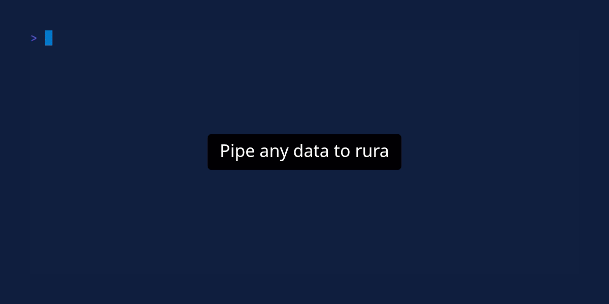

# Rura

Rura is an interactive TUI pipeline editor built for rapid iteration. It keeps your cursor in place and executes
commands – either in full or only up to your current position – eliminating the need to navigate shell history to refine
your logic.



## Features

- **Partial Pipeline Execution**: Execute only up to the current subcommand to debug complex pipes.
- **Live Execution Modes**: Real-time feedback as you type, with optional "Live Until Cursor" or "Live Full" modes.
- **Syntax Highlighting**: Visual feedback for subcommand boundaries, quotes, and pipes.
- **Persistent History**: Quickly access and reuse previous commands.
- **Customizable**: Fully configurable key bindings, themes, and UI placement via TOML.

## Installation

```bash
cargo install --path .
```

## Usage

You can start Rura by passing a file as an argument, piping data into it, or providing an initial command.

```bash
# Open a file
rura --file data.json

# Pipe data into rura
cat logs.txt | rura

# Start with an initial command
rura --command "grep error | sort"

# Print the last executed command from history without opening the UI
rura --last
```

### CLI Arguments

- `-f, --file <FILE>`: Path to the input file.
- `-c, --command <COMMAND>`: Initial command to populate the input field.
- `-C, --config <FILE>`: Path to a custom TOML configuration file.
- `-l, --last`: Print the last command from history and exit.
- `-V, --version`: Print version information.

## Key Bindings

### Command Execution

- **Enter**: Execute the full command pipeline.
- **Alt + \\**: Execute the pipeline up to the current subcommand (where your cursor is).
- **Alt + |**: Execute the pipeline up to the *previous* subcommand.
- **Alt + i**: Reset view to show the original input data.

### Navigation & View

- **Arrows** or **Alt + h/j/k/l**: Scroll the output (Left, Down, Up, Right).
- **PageUp / PageDown**: Scroll the output by page.
- **Ctrl + u / Ctrl + d**: Scroll up or down quickly.
- **Alt + Home / Alt + End**: Scroll to the beginning or end of the line (horizontal).
- **Alt + w**: Toggle line wrapping.
- **F2**: Toggle error display mode (Inline vs Pane).

### Live Execution Modes

- **F11**: Toggle "Live Until Cursor" mode. Executes the pipeline up to the cursor as you type.
- **F12**: Toggle "Live Full" mode. Executes the entire pipeline as you type.

### Command Input & Subcommands

- **Tab**: Move cursor to the next subcommand.
- **Shift + Tab / Backtab**: Move cursor to the previous subcommand.
- **Ctrl + p**: Previous command in history.
- **Ctrl + n**: Next command in history.

### General

- **F1**: Toggle help screen.
- **Ctrl + c**: Exit Rura. The last executed command is printed to your terminal.

## Configuration

Rura can be configured via a TOML file located at:
- **Linux**: `~/.config/rura/config.toml`
- **macOS**: `~/Library/Application Support/rura/config.toml`

### General Options

- `command_line_placement`: Set to `"top"` or `"bottom"` (default) to change where the input field is rendered.
- `highlight_duration_ms`: Duration in milliseconds for the temporary highlighting when executing commands (default: `250`).

### Customizing Key Bindings

You can override any default key binding in the `[keybindings]` section. Multiple keys can be assigned to the same action.

```toml
[keybindings]
quit = ["ctrl+q", "ctrl+c"]
execute_full = ["enter"]
subcommand_next = ["tab", "alt+right"]
```

### Customizing Theme

Colors and styles can be adjusted in the `[theme]` section. Supported colors include `red`, `green`, `yellow`, `blue`, `magenta`, `cyan`, `gray`, `black`, `white`, and hex codes (e.g., `"#ffffff"`).

Available theme keys:
- `cmd_regular`: Default subcommand style.
- `cmd_regular_pipe`: Style for the pipe character in regular mode.
- `cmd_regular_current`: Background style for the currently selected subcommand.
- `cmd_highlight`: Style for the subcommand being executed.
- `cmd_highlight_pipe`: Style for the pipe character during execution.
- `cmd_highlight_current`: Style for the current subcommand during execution.
- `cmd_quoted`: Style for quoted strings.
- `cmd_invalid`: Style for invalid subcommands (if parsing fails).
- `line_nums`: Style for line numbers in the output.

```toml
[theme.cmd_highlight]
fg = "black"
bg = "yellow"
bold = true

[theme.line_nums]
fg = "magenta"
```